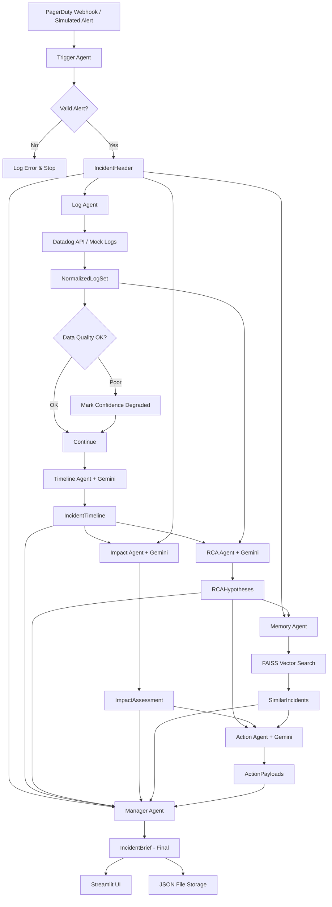

# RootSight — System Architecture

**Version:** 1.0  
**Date:** 2026-04-16  
**Status:** MVP Architecture

---

## 1. High-Level Architecture

```
┌─────────────────────────────────────────────────────────────────────┐
│                        EXTERNAL SYSTEMS                             │
│  ┌──────────┐  ┌──────────┐  ┌────────┐  ┌───────┐  ┌───────────┐ │
│  │ PagerDuty│  │ Datadog  │  │  Jira  │  │ Slack │  │CloudWatch │ │
│  └────┬─────┘  └────┬─────┘  └───▲────┘  └──▲────┘  └─────┬─────┘ │
└───────┼──────────────┼────────────┼──────────┼──────────────┼───────┘
        │ webhook      │ logs API   │ create   │ post         │ logs
        ▼              ▼            │          │              ▼
┌─────────────────────────────────────────────────────────────────────┐
│                      ROOTSIGHT CORE ENGINE                          │
│                                                                     │
│  ┌──────────────────────────────────────────────────────────────┐   │
│  │                    MANAGER AGENT                              │   │
│  │         (Orchestrator — CrewAI Sequential Flow)               │   │
│  └──┬──────┬──────┬──────┬──────┬──────┬──────┬─────────────────┘   │
│     │      │      │      │      │      │      │                     │
│     ▼      ▼      ▼      ▼      ▼      ▼      ▼                    │
│  ┌─────┐┌─────┐┌─────┐┌─────┐┌─────┐┌─────┐┌─────┐               │
│  │TRIG ││ LOG ││TIME ││ RCA ││IMPCT││ MEM ││ACTN │               │
│  │AGENT││AGENT││AGENT││AGENT││AGENT││AGENT││AGENT│               │
│  └──┬──┘└──┬──┘└──┬──┘└──┬──┘└──┬──┘└──┬──┘└──┬──┘               │
│     │      │      │      │      │      │      │                     │
│     ▼      ▼      ▼      ▼      ▼      ▼      ▼                    │
│  ┌──────────────────────────────────────────────────────────────┐   │
│  │                    SHARED DATA LAYER                          │   │
│  │  ┌──────────┐  ┌──────────────┐  ┌────────────────────────┐  │   │
│  │  │ Incident │  │ Vector Store │  │   Incident JSON Store  │  │   │
│  │  │ Context  │  │ (FAISS)      │  │   (File-based MVP)     │  │   │
│  │  └──────────┘  └──────────────┘  └────────────────────────┘  │   │
│  └──────────────────────────────────────────────────────────────┘   │
│                                                                     │
│  ┌──────────────────────────────────────────────────────────────┐   │
│  │                    GEMINI LLM LAYER                           │   │
│  │  Primary: Gemini Pro/Flash   │   Optional: Groq (summarize)  │   │
│  └──────────────────────────────────────────────────────────────┘   │
└─────────────────────────────────────────────────────────────────────┘
        │
        ▼
┌─────────────────────────────────────────────────────────────────────┐
│                      PRESENTATION LAYER                             │
│  ┌──────────────────────────────────────────────────────────────┐   │
│  │                    Streamlit Demo UI                          │   │
│  │  Trigger Panel │ Timeline │ Hypotheses │ Impact │ Actions    │   │
│  └──────────────────────────────────────────────────────────────┘   │
└─────────────────────────────────────────────────────────────────────┘
```

### Architecture Principles

1. **Agent isolation** — Each agent owns one responsibility and produces one schema-validated output
2. **Sequential execution** — MVP uses strict sequential flow; no parallelism needed yet
3. **Shared context** — Agents communicate through a shared incident context object, not direct calls
4. **Graceful degradation** — If any agent fails, downstream agents receive a degraded input and lower confidence
5. **LLM-as-reasoning-engine** — Gemini handles inference and natural language generation; agents handle structure, I/O, and validation
6. **Mock-first design** — Every external integration has a mock mode for demo and testing

---

## 2. Agents & Responsibilities

### Agent Registry

| Agent | Responsibility | Input | Output | LLM Required |
|---|---|---|---|---|
| **Trigger Agent** | Parse and validate incoming alert | PagerDuty webhook (or simulated) | `IncidentHeader` | No |
| **Log Agent** | Fetch, normalize, and filter logs | `IncidentHeader` + Datadog API | `NormalizedLogSet` | No |
| **Timeline Agent** | Extract events and build chronological timeline | `NormalizedLogSet` | `IncidentTimeline` | Yes (Gemini) |
| **RCA Agent** | Generate ranked root-cause hypotheses | `IncidentTimeline` + `NormalizedLogSet` | `RCAHypotheses` | Yes (Gemini) |
| **Impact Agent** | Estimate severity, duration, blast radius | `IncidentTimeline` + `IncidentHeader` | `ImpactAssessment` | Yes (Gemini) |
| **Memory Agent** | Retrieve similar past incidents | `IncidentHeader` + `RCAHypotheses` | `SimilarIncidents` | No (embedding only) |
| **Action Agent** | Generate follow-up action drafts | Full incident context | `ActionPayloads` | Yes (Gemini) |
| **Manager Agent** | Orchestrate pipeline, validate schemas, handle failures | Trigger event | `IncidentBrief` (final) | No |

---

## 3. Input/Output Contracts

### 3.1 IncidentHeader

```json
{
  "incident_id": "INC-2024-0847",
  "service": "payment-service",
  "alert_title": "High error rate on /api/checkout",
  "severity": "P1",
  "timestamp": "2024-03-15T14:23:00Z",
  "source": "pagerduty",
  "environment": "production",
  "region": "us-east-1",
  "description": "Error rate exceeded 15% threshold on payment-service",
  "deploy_markers": [
    {
      "version": "v2.14.3",
      "deployed_at": "2024-03-15T14:10:00Z",
      "deployer": "ci-pipeline"
    }
  ]
}
```

### 3.2 NormalizedLogSet

```json
{
  "incident_id": "INC-2024-0847",
  "source": "datadog",
  "time_window": {
    "start": "2024-03-15T13:53:00Z",
    "end": "2024-03-15T14:53:00Z"
  },
  "total_raw_count": 12847,
  "filtered_count": 342,
  "data_quality": {
    "completeness": "high",
    "noise_level": "medium",
    "deploy_markers_found": true,
    "confidence_impact": "none"
  },
  "logs": [
    {
      "timestamp": "2024-03-15T14:12:03Z",
      "level": "ERROR",
      "service": "payment-service",
      "message": "Connection refused: stripe-gateway:443",
      "metadata": {
        "trace_id": "abc123",
        "host": "prod-pay-03"
      }
    }
  ]
}
```

### 3.3 IncidentTimeline

```json
{
  "incident_id": "INC-2024-0847",
  "events": [
    {
      "timestamp": "2024-03-15T14:10:00Z",
      "event_type": "deploy",
      "description": "payment-service v2.14.3 deployed via CI pipeline",
      "evidence_source": "deploy marker",
      "severity": "info"
    },
    {
      "timestamp": "2024-03-15T14:12:03Z",
      "event_type": "error_spike",
      "description": "Connection refused errors to stripe-gateway begin",
      "evidence_source": "application logs",
      "severity": "critical"
    },
    {
      "timestamp": "2024-03-15T14:15:00Z",
      "event_type": "latency_spike",
      "description": "p99 latency on /api/checkout exceeds 5s",
      "evidence_source": "datadog metrics",
      "severity": "high"
    }
  ],
  "timeline_confidence": 85,
  "gaps": ["No logs between 14:11:00 and 14:12:00 — possible log delay"]
}
```

### 3.4 RCAHypotheses

```json
{
  "incident_id": "INC-2024-0847",
  "hypotheses": [
    {
      "rank": 1,
      "statement": "Deployment v2.14.3 introduced a misconfigured Stripe gateway endpoint",
      "confidence": 78,
      "supporting_evidence": [
        "Deploy at 14:10 precedes first errors by 2 minutes",
        "Connection refused errors target stripe-gateway:443",
        "No stripe errors in logs before 14:10"
      ],
      "contradicting_evidence": [
        "Other services using Stripe did not report errors"
      ],
      "missing_information": [
        "Diff of v2.14.3 deployment changes",
        "Stripe status page at incident time"
      ],
      "plausibility": "Timing correlation is strong. Deploy → error pattern is the most common incident cause."
    },
    {
      "rank": 2,
      "statement": "Stripe upstream outage caused connection failures",
      "confidence": 45,
      "supporting_evidence": [
        "Connection refused suggests remote host issue",
        "Multiple hosts affected simultaneously"
      ],
      "contradicting_evidence": [
        "Errors started exactly after deploy, not gradually",
        "No Stripe status page incident reported"
      ],
      "missing_information": [
        "Stripe health API check at incident time",
        "Network path diagnostics"
      ],
      "plausibility": "Possible but timing alignment with deploy makes this less likely."
    }
  ],
  "overall_confidence": 72,
  "reasoning_note": "High confidence in deploy correlation. Would increase to 90+ with deployment diff confirmation."
}
```

### 3.5 ImpactAssessment

```json
{
  "incident_id": "INC-2024-0847",
  "affected_services": ["payment-service", "checkout-frontend"],
  "severity": "P1",
  "estimated_duration_minutes": 23,
  "detection_to_response_minutes": 3,
  "user_impact": {
    "estimate": "qualitative",
    "description": "All checkout attempts failed during incident window. Estimated 2,000–5,000 affected transactions based on typical traffic.",
    "confidence": 60,
    "data_limitation": "Exact user count unavailable without analytics integration"
  },
  "business_impact": {
    "description": "Direct revenue loss from failed checkouts. Potential cart abandonment beyond incident window.",
    "blast_radius": "payment-critical path only; browse/search unaffected"
  }
}
```

### 3.6 SimilarIncidents

```json
{
  "incident_id": "INC-2024-0847",
  "matches": [
    {
      "matched_incident_id": "INC-2024-0612",
      "title": "Stripe connection failures after payment-service deploy",
      "similarity_score": 0.87,
      "similarity_reason": "Same service, same error pattern (connection refused to Stripe), also post-deploy",
      "previous_root_cause": "Hardcoded Stripe endpoint URL overwritten by config change in deploy",
      "previous_resolution": "Rollback to v2.13.8 + config fix in v2.13.9",
      "pattern_applies": true
    }
  ],
  "no_match_message": null
}
```

### 3.7 ActionPayloads

```json
{
  "incident_id": "INC-2024-0847",
  "actions": {
    "immediate_checks": [
      "Verify Stripe gateway connectivity from payment-service pods",
      "Check deployment diff for v2.14.3 config changes"
    ],
    "mitigation": [
      {
        "action": "Rollback payment-service to v2.14.2",
        "risk_level": "low",
        "approval_required": true,
        "reason": "Reversible; matches pattern from INC-2024-0612"
      }
    ],
    "jira_ticket": {
      "project": "INCIDENT",
      "summary": "[P1] Payment checkout failures — Stripe connection refused post-deploy v2.14.3",
      "description": "...(generated from incident brief)...",
      "priority": "Highest",
      "labels": ["incident", "payment-service", "stripe", "deploy-related"],
      "assignee_suggestion": "payment-team-oncall"
    },
    "slack_message": {
      "channel": "#incidents",
      "text": "🔴 **P1 Incident — payment-service**\nCheckout failures due to Stripe connection errors post-deploy v2.14.3.\nImpact: ~2K-5K failed transactions. Duration: 23 min.\nHypothesis: Deploy config change (78% confidence).\nAction: Rollback under review."
    },
    "follow_up": [
      "Write post-mortem using RootSight incident brief as base",
      "Add Stripe connectivity health check to deploy pipeline",
      "Review config management process for payment-service"
    ]
  }
}
```

### 3.8 IncidentBrief (Final Composite)

```json
{
  "incident_id": "INC-2024-0847",
  "generated_at": "2024-03-15T14:28:00Z",
  "processing_time_seconds": 127,
  "header": { "...IncidentHeader..." },
  "timeline": { "...IncidentTimeline..." },
  "hypotheses": { "...RCAHypotheses..." },
  "impact": { "...ImpactAssessment..." },
  "similar_incidents": { "...SimilarIncidents..." },
  "actions": { "...ActionPayloads..." },
  "overall_confidence": 72,
  "confidence_note": "Moderate-high confidence. Deploy correlation is strong but unconfirmed without deployment diff. Stripe external status unverified.",
  "agent_status": {
    "trigger": "success",
    "log": "success",
    "timeline": "success",
    "rca": "success",
    "impact": "success",
    "memory": "success",
    "action": "success"
  }
}
```

---

## 4. Data Flow



### Execution Sequence (MVP — Sequential)

```
1. Trigger Agent     →  parse webhook          →  IncidentHeader
2. Log Agent         →  fetch + normalize logs  →  NormalizedLogSet
3. Timeline Agent    →  extract + sequence      →  IncidentTimeline
4. RCA Agent         →  generate hypotheses     →  RCAHypotheses
5. Impact Agent      →  estimate blast radius   →  ImpactAssessment
6. Memory Agent      →  vector similarity search → SimilarIncidents
7. Action Agent      →  draft Jira + Slack      →  ActionPayloads
8. Manager Agent     →  compose final brief     →  IncidentBrief
```

Each agent receives the shared context object, adds its output, and passes it forward. The Manager validates schema at each step.

---

## 5. Storage Design

### MVP: File-Based + In-Memory

| Store | Technology | Purpose | Persistence |
|---|---|---|---|
| **Incident Context** | In-memory Python dict | Pass data between agents during a run | Session-scoped |
| **Incident Briefs** | JSON files on disk | Store completed incident analyses | Persistent |
| **Vector Index** | FAISS (local file) | Similarity search for past incidents | Persistent (`.faiss` + `.pkl`) |
| **Incident Metadata** | JSON file (`incidents.json`) | Index of past incidents for memory agent | Persistent |
| **Configuration** | `.env` file | API keys, model config, feature flags | Persistent |

### Directory Structure for Data

```
data/
├── incidents/                   # Completed incident briefs
│   ├── INC-2024-0847.json
│   └── INC-2024-0612.json
├── memory/                      # Vector store
│   ├── incident_index.faiss
│   └── incident_metadata.pkl
├── seed/                        # Pre-seeded demo data
│   ├── sample_incidents/
│   │   └── demo_incident_01.json
│   └── sample_logs/
│       └── demo_logs_01.json
└── mock/                        # Mock API responses
    ├── pagerduty_webhook.json
    └── datadog_logs.json
```

### Post-MVP: Upgrade Path

| Current (MVP) | Upgrade To | When |
|---|---|---|
| JSON files | PostgreSQL | When incident count > 500 |
| FAISS local | Chroma server or Pinecone | When multi-user or API-served |
| In-memory context | Redis | When running as a service |
| `.env` config | Vault / GCP Secret Manager | When deployed to cloud |

---

## 6. Integration Points

### Inbound (Data Sources)

| Integration | Protocol | Auth | MVP Status |
|---|---|---|---|
| **PagerDuty** | Webhook (HTTP POST) | Webhook signature verification | ✅ Simulated + real |
| **Datadog** | REST API (Logs Search) | API Key + App Key | ✅ Real + mock fallback |
| **CloudWatch** | AWS SDK (Logs) | IAM credentials | ❌ Post-MVP |

### Outbound (Action Targets)

| Integration | Protocol | Auth | MVP Status |
|---|---|---|---|
| **Jira** | REST API v3 | API token | ⚠️ Payload generation only (no API call in MVP) |
| **Slack** | Web API | Bot token | ⚠️ Payload generation only (no API call in MVP) |
| **Confluence** | REST API | API token | ❌ Post-MVP |

### LLM Layer

| Provider | Use Case | Model | Fallback |
|---|---|---|---|
| **Google Gemini** | RCA reasoning, timeline analysis, impact estimation, action generation | `gemini-2.0-flash` or `gemini-2.5-pro` | Retry with smaller prompt |
| **Groq** (optional) | Fast summarization, Slack message formatting | `llama-3.1-70b` | Skip; use Gemini |
| **Embedding** | Incident similarity | `text-embedding-004` (Google) | Sentence Transformers local |

---

## 7. Failure Modes & Handling

| Failure | Impact | Detection | Handling |
|---|---|---|---|
| **PagerDuty webhook malformed** | Cannot start pipeline | Schema validation in Trigger Agent | Return 400 error; log incident |
| **Datadog API timeout** | No logs for analysis | HTTP timeout (30s) | Retry 3x → fall back to mock data with warning |
| **Datadog API rate limited** | Partial log set | HTTP 429 response | Use cached/partial logs; degrade confidence |
| **Gemini API failure** | Timeline/RCA/Impact agents fail | HTTP error or timeout | Retry 2x → produce "analysis unavailable" stub |
| **Gemini hallucination** | Incorrect hypothesis | Cannot auto-detect | Mitigated by prompt engineering, evidence linking, confidence scoring |
| **FAISS index missing** | No similar incident matches | File not found | Return "no historical data available" |
| **FAISS returns irrelevant match** | Misleading similar incident | Low similarity score | Threshold filter (< 0.5 score → "no strong match") |
| **Agent produces invalid schema** | Downstream agents receive bad input | JSON schema validation | Manager logs error, inserts empty stub, continues with warning |
| **Full pipeline failure** | No output | Manager tracks agent status | Return partial brief with available sections + failure report |

### Degradation Strategy

```
Full Success:     All 7 agents succeed → complete IncidentBrief
Partial Success:  1-2 agents fail → brief with missing sections marked "[UNAVAILABLE]"
Minimal Output:   Only Trigger + Log succeed → raw log dump with timestamp header
Total Failure:    Trigger fails → error response, no brief generated
```

---

## 8. MVP Simplifications

> [!IMPORTANT]
> These are intentional tradeoffs to ship a working MVP. Each has a clear upgrade path.

| Area | MVP Approach | Production Approach |
|---|---|---|
| **Execution model** | Sequential (agent 1 → 2 → 3...) | Parallel where possible (Timeline + Impact concurrently) |
| **Storage** | JSON files on disk | PostgreSQL + Redis |
| **Vector store** | FAISS local file | Managed vector DB (Chroma/Pinecone) |
| **Auth** | None (local demo) | OAuth2 / API keys |
| **Multi-tenancy** | Single user | Team-based access control |
| **Action execution** | Draft only (no API calls) | Approval gate → execute via API |
| **Log sources** | Datadog only | Datadog + CloudWatch + Elastic + custom |
| **Incident memory** | Pre-seeded + current session | Continuous learning from all resolved incidents |
| **Error handling** | Basic try/catch + degradation | Circuit breakers, dead letter queues |
| **Monitoring** | Print statements + Streamlit status | Structured logging, OpenTelemetry |
| **Prompt management** | Inline strings | Prompt registry with versioning |
| **Rate limiting** | None | LLM call budgets per incident |

---

## 9. Security Considerations (MVP)

| Concern | MVP Approach |
|---|---|
| API keys in source | `.env` file + `.gitignore` |
| Log data sensitivity | Warn in README; no PII filtering in MVP |
| LLM prompt injection via logs | Low risk in demo; post-MVP needs input sanitization |
| Webhook authentication | Skip in MVP; post-MVP verify PagerDuty signatures |
| Incident data at rest | Unencrypted JSON; acceptable for local demo |

---

## 10. Architecture Decision Records

### ADR-1: CrewAI for Orchestration

**Decision:** Use CrewAI for multi-agent orchestration.  
**Rationale:** CrewAI provides built-in sequential/parallel task execution, agent role definitions, and tool integration. Reduces custom orchestration code.  
**Risk:** CrewAI is relatively young; may hit edge cases. Mitigation: agents are designed to work standalone if needed.

### ADR-2: FAISS over Chroma for MVP

**Decision:** Use FAISS for vector similarity search.  
**Rationale:** Zero server dependency, runs locally, fast for < 10K incidents. Chroma adds unnecessary complexity for demo.  
**Upgrade path:** Swap to Chroma server when multi-user or persistent API is needed.

### ADR-3: Sequential Execution for MVP

**Decision:** Agents execute strictly sequentially.  
**Rationale:** Simplifies debugging, ensures data dependencies are met, avoids race conditions. Parallel execution is an optimization, not a requirement.  
**Upgrade path:** Identify independent agents (Impact ∥ Memory) and parallelize post-MVP.

### ADR-4: Draft-Only Actions

**Decision:** Action Agent generates payloads but does NOT call Jira/Slack APIs in MVP.  
**Rationale:** Avoids accidental production side effects during demos, reduces integration surface, and focuses the demo on intelligence quality, not action execution.  
**Upgrade path:** Add approval gate UI → execute on confirmation.

### ADR-5: Gemini as Primary LLM

**Decision:** Use Google Gemini (Flash or Pro) for all LLM-powered agents.  
**Rationale:** Strong reasoning capabilities, long context window for log analysis, good cost/performance ratio. Single-provider simplifies auth and billing.  
**Risk:** Gemini-specific prompt tuning may not transfer to other models. Acceptable for MVP.
